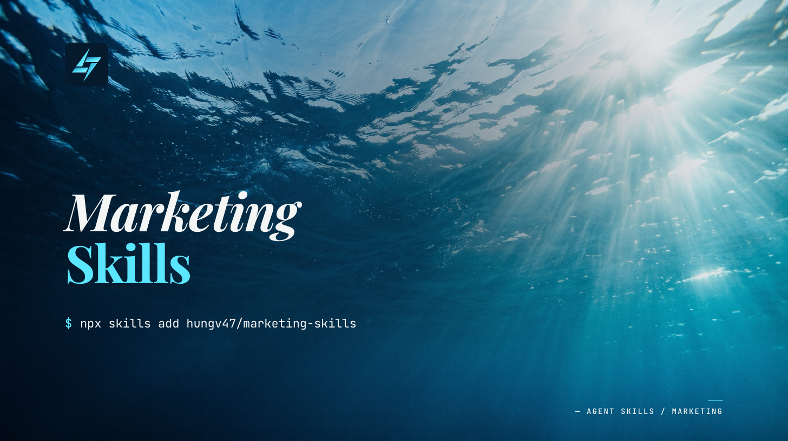

# Marketing Skills



> **Agent Skills 2.0** — fresh start on the `refactor/v2.0` branch. Install via `npx skills add hungv47/marketing-skills@refactor/v2.0`. The `main` branch holds the legacy v7.x line.

Brand identity, persuasive copy, campaign planning, landing-page architecture, post-launch landing-page evaluation, design briefs, search visibility, humanization, localization polish, outbound, paid Meta ads, short-form video briefs, and platform-native social-copy. 13 skills (plus `/orchestrate-marketing` orchestrator).

**New here?** Run `/orchestrate-marketing` — it reads brand/research state, parses your ask, and proposes the next skill to invoke with rationale + cost + duration.

## Install

Installs via the [`skills` CLI](https://skills.sh). Requires Node.js 18+. Auto-detects Claude Code, Cursor, Codex, Windsurf, Gemini CLI, or VS Code.

```bash
# Install the full marketing stack (Agent Skills 2.0)
npx skills add hungv47/marketing-skills@refactor/v2.0

# Cherry-pick a single skill (any skill in the stack — these are just examples)
npx skills add hungv47/marketing-skills@refactor/v2.0 --skill copywriting
npx skills add hungv47/marketing-skills@refactor/v2.0 --skill seo
npx skills add hungv47/marketing-skills@refactor/v2.0 --skill humanize

# List available skills without installing
npx skills add hungv47/marketing-skills@refactor/v2.0 --list

# Target a specific editor
npx skills add hungv47/marketing-skills@refactor/v2.0 --agent claude-code

# Install globally (available in every project)
npx skills add hungv47/marketing-skills@refactor/v2.0 -g
```

**Legacy v7.x install** (main branch — no `@refactor/v2.0` suffix):

```bash
npx skills add hungv47/marketing-skills
```

See the [root README](https://github.com/hungv47/agent-skills#install) for the full install reference.

### Alternative: Claude Code plugin

For Claude Code users who prefer the native plugin system:

```
/plugin marketplace add hungv47/agent-skills
/plugin install marketing-skills@agent-skills
```

Skills are then namespaced — call them as `/marketing-skills:copywriting`, `/marketing-skills:seo`, etc. **`npx skills add` is recommended for most users** (editor-agnostic, no namespace prefix, per-skill cherry-pick). Plugin path is Claude Code only.

## Pipeline

```
research-skills/skills/icp-research        → research/product-context.md, research/icp-research.md
                                          ↓
brand-system                         → brand/BRAND.md, brand/DESIGN.md, brand/ASSETS.md
                                          ↓
campaign-plan                             → .agents/skill-artifacts/mkt/campaign-plan.md
                                          ↓
                ┌─────────────┬───────────┼───────────┬─────────────┐
                ↓             ↓           ↓           ↓             ↓
           lp-brief        seo         ad-copy   cold-outreach   short-form-brief
           (per page)   (per mode)   (per temp)  (per touch)     (per video) → social-copy
                ↓                                                              (per platform)
           design-brief
           (per slot)

Post-launch measurable pages: eval-loop → lp-eval → results.tsv / learnings.md

Horizontal: copywriting, humanize, vn-tone — invoked at any stage.
```

## Skills

### `brand-system` — build a visual identity

Creates brand identity systems — color palettes, typography, design tokens, logo guidelines, voice definition, and component specs.

**Use when:**
- You're launching a product and need a cohesive visual identity before any marketing
- You want design tokens that ensure consistency across all touchpoints
- You need brand voice guidelines that downstream copy and design skills can follow

**Not for:** writing marketing copy (use `copywriting`) or mapping user flows (use `user-flow`)

**Produces:** `brand/BRAND.md` + `brand/DESIGN.md` + `brand/ASSETS.md`

---

### `campaign-plan` — plan the campaign

Creates integrated marketing plans — channel strategy, positioning, content calendar, budget allocation, and go-to-market timelines.

**Use when:**
- You're planning a product launch and need to decide where, when, and how much to spend
- You want a structured calendar with channel-specific tactics
- You need to allocate budget across PLG and SLG channels

**Not for:** setting numeric targets (use `funnel-planner`)

**Produces:** `.agents/skill-artifacts/mkt/campaign-plan.md`

---

### `copywriting` — write persuasive copy

Headlines, hooks, CTAs, taglines, and full-page section copy with rubric scoring, annotations, and ranked alternatives. Horizontal — composes inside any other skill that needs sharp copy on a specific surface.

**Use when:**
- You need a headline that stops scrolling or a CTA that converts
- You have existing copy that needs to be sharper, more specific, or more persuasive
- You want copy evaluated with a rubric and scored alternatives

**Not for:** AI pattern removal (use `humanize`)

**Produces:** `.agents/skill-artifacts/mkt/content/[slug].copy.md`

---

### `lp-brief` — architect a high-converting landing page

Generates a campaign-grade brief for a landing page or redesign — hypothesis, surface rhythm, section-by-section spec, asset slots, copy candidates, hand-off prompts. Owns the landing-page conversion-principles rubric directly, so best practices are built into the page before launch.

**Use when:**
- You need a brief precise enough for a designer or AI tool to execute
- You're shipping a new campaign landing page and want one document that holds hypothesis + architecture + per-section spec + asset routing
- You're revising an existing page and want the next rev anchored in page state, ICP, and any post-launch evidence
- You want copy candidates and design-tool handoff prompts in one artifact

**Not for:** post-launch CRO analysis from analytics/experiments (use `lp-eval` inside an eval loop), or single-asset creative (use `design-brief`)

**Produces:** `.agents/skill-artifacts/mkt/lp-brief/[slug]/brief.md` + per-target handoff prompts + per-slot prompts

---

### `lp-eval` — evaluate a launched landing page

Scores landing-page performance from real evidence inside an existing eval loop — analytics, experiment results, form funnels, recordings/heatmaps, or operator-supplied metric notes.

**Use when:**
- A page has shipped and you need a keep/discard/watch/blocked decision for the current cycle
- You have a measurement window, source, primary metric value, and baseline or prior result
- You want landing-page evidence to update `results.tsv` and durable loop learnings

**Not for:** new page briefs or redesign specs (use `lp-brief`), generic heuristic audits without metric evidence, or creating the loop workspace (use `eval-loop`)

**Produces:** `skills-resources/loops/[slug]/evals/[date]-cycle-N.md` + appends `skills-resources/loops/[slug]/results.tsv`

---

### `design-brief` — write a graphic-design brief for a single visual asset

Produces graphic-design briefs for individual visuals — IG carousel/post/story, LinkedIn doc/single, FB ad, YouTube thumbnail, X card, banner/display ad, OOH/billboard, OG share card, hero illustration. Pulls brand-system tokens, generates concept directions, writes a per-asset brief with platform-aware specs (aspect, safe zones, type scale, contrast, file format, anti-patterns) and the downstream handoff (image-gen prompt, vector-tool spec, or designer-handoff). **Does NOT render the asset — rendering is downstream via image-gen / Pencil / Figma / human designer.**

**Use when:**
- You need a brief that lets a designer or image-gen tool execute a single asset on-brand and on-platform without follow-up
- You're consuming an `lp-brief` slot spec and need a per-asset brief for the slot
- You want a generative-AI prompt that respects brand tokens, platform safe zones, and CTA hierarchy

**Not for:** rendering the asset (run an image-gen tool / Pencil / Figma against the brief), defining brand identity (use `brand-system`), redesigning a whole page (use `lp-brief`), or writing the copy that goes IN the asset (use `copywriting`).

**Status note:** Re-scoped from a previous render-focused skill. Per-platform module specs (IG/LinkedIn/FB/YT/X/OOH/banner) currently ship as a skeleton — practitioner-grade specs need a follow-up build pass.

**Produces:** `.agents/skill-artifacts/mkt/design-briefs/[slug].md`

---

### `seo` — grow organic visibility

Technical audit, keyword research, AI/AEO optimization, programmatic SEO, competitor analysis, and app store optimization (ASO).

**Use when:**
- You want more organic traffic from search engines or AI answer engines
- You need a technical SEO audit of your site
- You want to build programmatic SEO pages at scale
- You need app store optimization for iOS or Android

**Not for:** landing-page construction/conversion brief work (use `lp-brief`) or writing copy (use `copywriting`)

**Produces:** `.agents/skill-artifacts/mkt/seo-[mode].md`

---

### `humanize` — make AI text read human

Strips AI patterns, injects brand voice, and compresses existing text. Targets 15%+ word reduction with zero idea loss.

**Use when:**
- You have AI-generated content that sounds robotic or generic
- You want to inject a specific brand voice into existing text
- You need to compress text for density without losing meaning

**Not for:** writing new copy from scratch (use `copywriting`)

**Produces:** `.agents/skill-artifacts/mkt/content/[slug].humanized.md`

---

### `vn-tone` — polish translated Vietnamese into native register

Post-translation polish for Vietnamese text. Detects translation giveaways (pronoun drift, missing sentence-final particles, literal idiom calques, passive-voice calques, corporate translationese, typography) and rewrites into one of four target registers: **báo chí** (news/formal), **semi-casual** (tech community/blogger), **bro** (Otofun or Voz forum casual), or **pop-marketing** (consumer marketing/lifestyle).

Uses a live-scraped corpus from VnExpress, Chinhphu.vn, Tinhte, Spiderum, Otofun, Voz, and Kenh14 as the register reference.

**Use when:**
- You have Vietnamese text that was translated from English (by AI, MT, or a non-native writer) and reads robotic
- You have native Vietnamese copy that needs register alignment (e.g., corporate voice that should be bro-community)
- You're localizing marketing copy and need the final polish before publication
- Your brand serves a Vietnamese audience and generic MT output won't land

**Not for:** translating from English to Vietnamese (use your preferred MT first, then this), writing new Vietnamese from scratch (use `copywriting`), or stripping AI patterns in English (use `humanize` first, then translate, then `vn-tone`).

**Produces:** `.agents/skill-artifacts/mkt/content/[slug].vn-tone.md`

---

### `ad-copy` — write Meta paid-ad copy (retargeting + cold-traffic)

Writes hero + 2 variants of Meta paid-ad copy (Facebook + Instagram), audience-temperature-aware (retargeting / cold), with hard char-cap enforcement, policy + claim substantiation gates, and a 6-dimension critic rubric. Automatic humanize terminal pass per variant. Meta-only at v1 — Google RSA, LinkedIn, TikTok Ads reserved for future expansion.

**Use when:**
- You're shipping a Meta retargeting campaign and want creative that respects the warm-audience objection map (fit / credibility / timing), not cold-creative reused as warm
- You're shipping Meta cold-traffic for a subscription app and need trial-start-optimized copy, dedicated creative, and Apple-24h-signal-aware framing
- You're testing 3 distinct angles (hero + A + B) and want them genuinely distinct, not surface-level paraphrases

**Not for:** Google RSA / LinkedIn / TikTok Ads (refs not pre-staged — would force fabrication), audience setup or budget pacing (Ads Manager workflow), landing page copy (use `copywriting` or `lp-brief`), cold-outreach DMs (use `cold-outreach`), creative asset production (this skill produces copy spec only).

**Produces:** `.agents/skill-artifacts/mkt/ad-copy/[audience-temp]-[date]-[slug].md` + `[slug].rationale.md` + `[slug].critic-score.md`

---

### `cold-outreach` — write cold outbound messages

Writes and evaluates cold outreach across email, LinkedIn (DM + connection note), Twitter/X (reply + DM), and platform proposals (Upwork, Fiverr, similar). Signal-based personalization, channel-specific craft, 5-dimension rubric scoring, automatic humanize terminal pass. Supports first-touch compose and inbound-reply handling.

**Use when:**
- You're writing a cold email, cold DM, or proposal and want it to read like a sharp human, not a template
- You need a reply to an inbound response (not-interested / no-budget / send-info / curious / qualified / later / hostile / ambiguous)
- You're doing services-sell, saas-sell, partnership-sell, or community-sell outbound

**Not for:** sourcing or list-building (start at "here's who I'm reaching"), campaign orchestration across many prospects (compose touches individually with prior-touches context), fundraise/hiring outreach (different norms), or lifecycle/nurture emails (those are warm, consent-based, different craft).

**Produces:** `.agents/skill-artifacts/mkt/cold-outreach/[slug].md` + `[slug].rationale.md` + `[slug].critic-score.md`

---

## Cross-Stack

- `brand-system`, `campaign-plan`, `copywriting`, `lp-brief`, `seo`, `cold-outreach`, `ad-copy`, `design-brief` read `research/product-context.md` from [research-skills](https://github.com/hungv47/research-skills)
- `cold-outreach` and `ad-copy` additionally read `research/icp-research.md` for target persona pain language
- `campaign-plan` and `lp-brief` can read `.agents/skill-artifacts/meta/sketches/prioritize-*.md` and `.agents/skill-artifacts/meta/records/targets-*.md` from research-skills
- `lp-eval` requires loop scaffolding from `meta-skills` `/eval-loop` and writes into `skills-resources/loops/[slug]/`

## Releases

```bash
# Update to latest version (if already installed)
npx skills update

# Add this stack to your project
npx skills add hungv47/marketing-skills
```

## Changelog

Full release history with per-version notes: [marketing-skills/releases](https://github.com/hungv47/marketing-skills/releases)

## License

MIT
